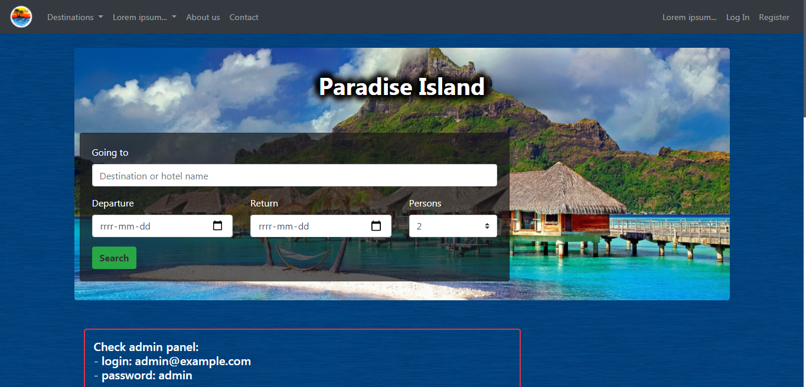
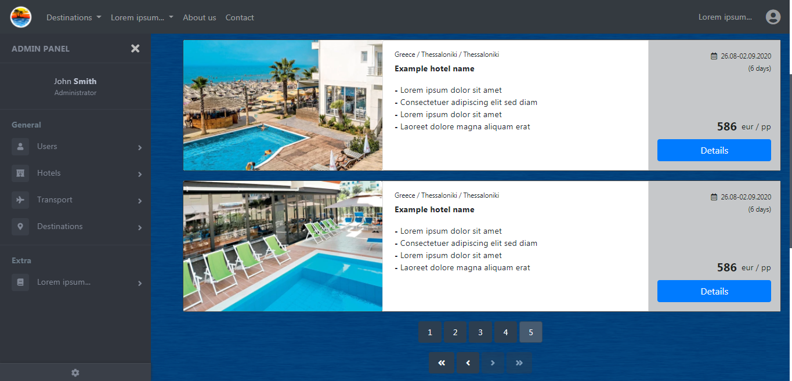
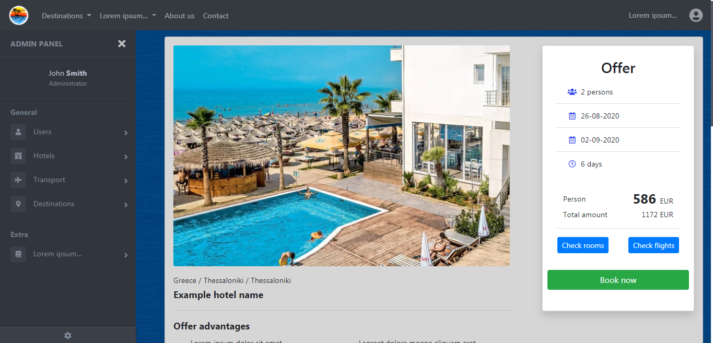
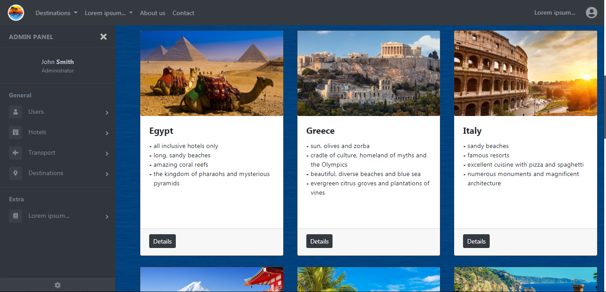
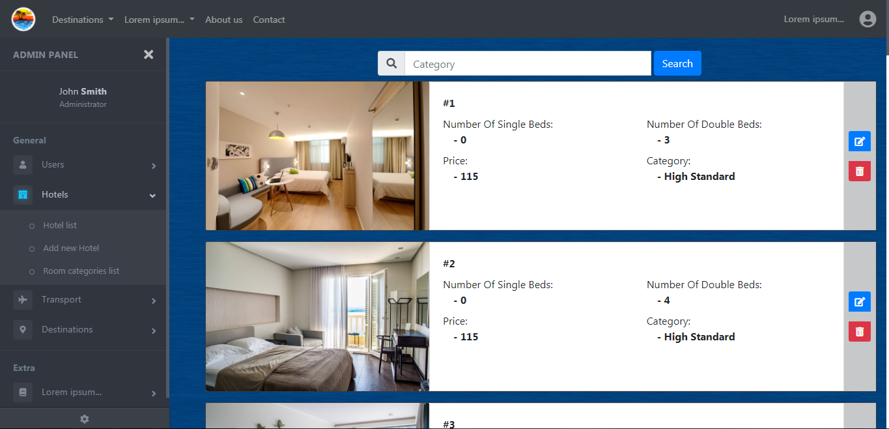
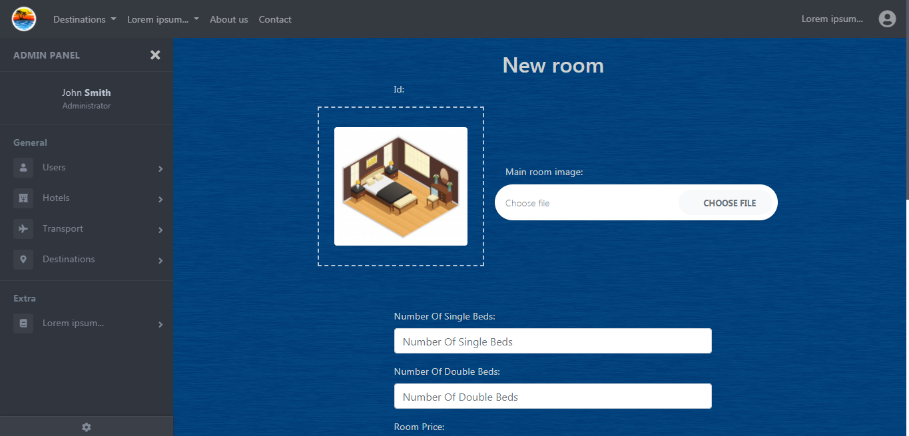
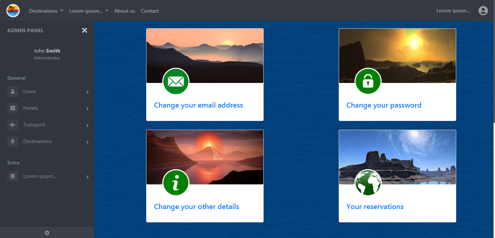
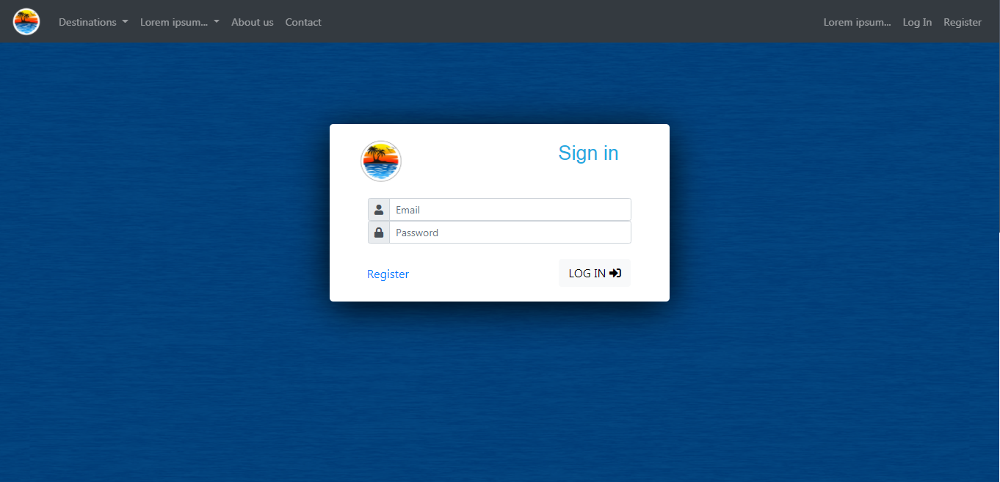

# Paradise Island

"Paradise Island" is a web app for reservation trips in travel agency.

### Run

Application deployed on VPN by this [link](www.paradiseisland.com.pl)  
Check admin panel - login: admin@example.com, password: admin  
Check user panel - login: user@example.com, password: user  

  
  
  
  
  
  
  

### Tech

* [Java] - v11
* [Spring Boot] - v2.2.2
* [Spring Data JPA]
* [Spring MVC]
* [Spring Security]
* [MySQL] - v8.0
* [Maven] - v3.6.3
* [AngularJS] - v1.7.9
* [Bootstrap] - v4.3.1

### Todos

 - Write Tests

   [Java]: <https://www.java.com>
   [Spring Boot]: <https://spring.io/projects/spring-boot>
   [Spring Data JPA]: <https://spring.io/projects/spring-data-jpa>
   [Spring MVC]: <https://docs.spring.io/spring/docs/current/spring-framework-reference/web.html>
   [Spring Security]: <https://spring.io/projects/spring-security>
   [MySQL]: <https://www.mysql.com/>
   [Maven]: <https://maven.apache.org/>
   [AngularJS]: <https://angularjs.org/>
   [Bootstrap]: <https://getbootstrap.com/>
